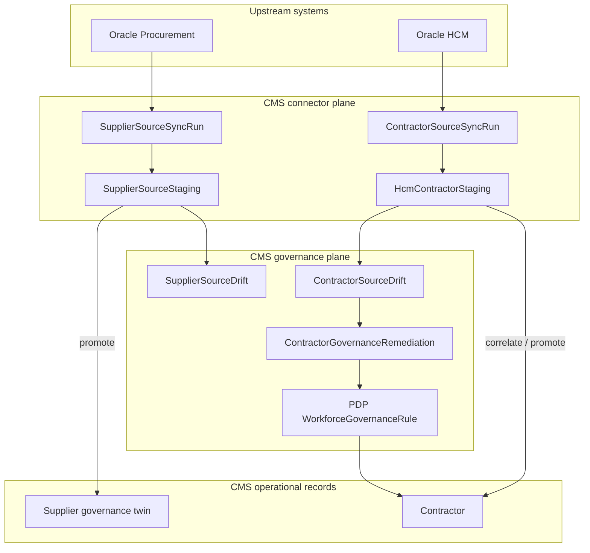

# Connector & governance platform — reference guide

> **Status:** Demo-ready (supplier + workforce connectors, drift, remediation, PDP cascade).
> **Audience:** Engineering, UAT, demos, solution architecture.

## Key line (demos)

```text
Oracle provides source truth; CMS governs operational trust.
```

**Enterprise narrative:**

```text
We operationalize trust after enterprise-system ingestion.
```

—not—“we synchronized Oracle.”

| Pattern | Upstream | CMS |
|---------|----------|-----|
| Suppliers | Oracle Procurement (master) | Operational supplier trust |
| Contractors | Oracle HCM (bootstrap) | Operational contractor authority |

Three layers must stay distinct: **bootstrap lineage**, **operational governance**, **signal lifecycle** (persist / decay / archive). See [`CONTRACTOR_BOOTSTRAP_AUTHORITY.md`](CONTRACTOR_BOOTSTRAP_AUTHORITY.md) and [`GOVERNANCE_SIGNAL_LIFECYCLE.md`](GOVERNANCE_SIGNAL_LIFECYCLE.md).

Default workforce drift APIs use `operationalOnly=true` so operators see what matters **now**, not every historical inconsistency.

## Product doctrine — source truth vs operational trust

These are **separate concerns**. CMS sits in the **operational trust** layer — not in the business of replacing every upstream master.

| Domain | Source truth | Operational trust |
|--------|--------------|-------------------|
| Suppliers | Oracle Procurement | CMS |
| Contractors | CMS after HCM bootstrap (one-time / waves) | CMS |

**Contractor bootstrap doctrine:** HCM is not continuous workforce authority after materialization. See [`CONTRACTOR_BOOTSTRAP_AUTHORITY.md`](CONTRACTOR_BOOTSTRAP_AUTHORITY.md).

CMS is not primarily answering *“Who created the entity?”* It answers:

```text
Can the organization operationally trust and use this entity?
```

That is the governance boundary: identity/business truth from upstream (where configured); **operational trust and usability** from CMS (evidence, sponsor, restrictions, remediation, PDP).

**Supplier evidence authority:** On `ORACLE_ONLY` tenants, synced Oracle-linked suppliers **inherit procurement onboarding evidence**; CMS does not block `ACTIVE` on missing CMS document uploads. See [`SUPPLIER_GOVERNANCE_OPERATIONS.md`](SUPPLIER_GOVERNANCE_OPERATIONS.md).

| Old phrase | Wrong implication |
|------------|-------------------|
| Governance twin | Duplicate supplier mastery |
| Promote supplier | CMS owns supplier creation |
| Access review (as flagship) | External IGA owns the story |
| Terminated upstream-active | Upstream lifecycle authority |

Supplier and contractor flows are **parallel** (same trust-layer pattern) but **not identical** (Oracle remains supplier master; HCM is bootstrap-only for contractors). That asymmetry is intentional.

**Demo framing:** we do not preload outcomes — reset the tenant, then ingest from a mock Oracle API through the same connector path used for production Oracle. **Governance behavior emerges from ingestion**, not seeded UI state. See [`CONNECTOR_DEMO_UAT.md`](CONNECTOR_DEMO_UAT.md).

CMS is **governance orchestration infrastructure** — not supplier onboarding software. Oracle HCM **bootstraps** contractor identities once; **CMS owns contractor lifecycle** afterward (sponsor, status, restrictions). The flagship demo scenario is **unsponsored imported contractor** → `UNSPONSORED_CONTRACTOR` drift → remediation → PDP (contractor stays active until CMS action). Connectors stage bootstrap data; CMS governance **detects, classifies, and responds**; PDP enforces runtime restrictions without silent identity mutation.

---

## Platform doctrine

| Principle | Meaning |
|-----------|---------|
| **Source truth upstream** | Oracle Procurement owns supplier masters; Oracle HCM supplies bootstrap workforce identity |
| **CMS authoritative contractors** | After import, contractor lifecycle, sponsor, and operational restrictions are CMS-owned (HCM = bootstrap only) |
| **CMS governance record** | “Create governance record” links Oracle supplier → CMS `PENDING_APPROVAL` — never `ACTIVE` from sync alone |
| **Governance overview navigation** | `/suppliers` tiles drill down to filtered lists and approvals queue (not static KPIs) |
| **Procurement evidence trust** | `ORACLE_ONLY` → approval/PDP skip CMS doc checklist when Oracle-linked + `SYNCED` |
| **Detect → classify → govern** | Drift registry is authoritative; remediation orchestrates human response |
| **Drift ≠ auto-mutation** | No auto-disable, auto-delete, or Soffid revocation from connectors |
| **Remediation ≠ mutation** | PDP restricts operations; humans close the loop |
| **Authority-aware UI** | `ORACLE_ONLY` suppliers hide “Add Supplier”; portal shows “Complete compliance profile” |
| **Replay-safe staging** | Re-import upserts by org + external id / person id — no duplicate staging rows |

### Three governance layers (workforce)

```text
ContractorSourceDrift          ← authoritative risk signal
ContractorGovernanceRemediation ← orchestrated human response
PDP (WorkforceGovernanceRule)  ← runtime restriction (reversible)
```

Do **not** collapse these into one object.

### External Source Governance Pattern (evidence-driven)

Both domains follow the same discipline **after evidence acquisition** — documented in [`EXTERNAL_SOURCE_GOVERNANCE_PATTERN.md`](EXTERNAL_SOURCE_GOVERNANCE_PATTERN.md). This is intentional consistency across HCM and Procurement, not a claim that every future connector must match before proof.

```text
Connector acquires evidence → immutable snapshot → EWP assesses → EWP governs → EWP operationalizes
```

Workforce: `DISC-…` snapshots. Suppliers: `SYNC-…` snapshots. Assessment blocked until a new snapshot exists.

### Symmetric governance pattern (different upstream authority)

Both domains use the same CMS pattern — **govern operational trust** — but upstream authority differs:

| Upstream | CMS role | Upstream remains master? |
|----------|----------|---------------------------|
| Oracle Procurement | Supplier operational governance | **Yes** — Oracle owns supplier master |
| Oracle HCM | Contractor operational governance | **No** — HCM is bootstrap only; CMS is contractor authority after import |

**Supplier flow (business language):**

```text
Oracle Procurement creates supplier
→ CMS syncs supplier metadata
→ CMS creates governance record
→ CMS governs operational trust
```

**Contractor flow:**

```text
Oracle HCM bootstraps contractor
→ CMS materializes contractor
→ CMS becomes contractor authority
→ CMS governs operational trust
```

**Language to avoid in demos** (implies wrong authority): governance twin, promote supplier, access review as flagship, terminated upstream-active.

**Consistent message:** CMS governs operational trust — it does not replace every upstream system.

---

## Maturity map (delivery slices)

### Oracle Procurement (supplier)

| Slice | Focus | Doc |
|-------|--------|-----|
| **1A–1C** | REST client, sync ledger, replay-safe staging | [PR-CMS-CONNECTOR-1A-C](business/PR-CMS-CONNECTOR-1A-C_ORACLE_PROCUREMENT_REST.md) |
| **1D–1E** | Connector health, stale semantics, telemetry, ops dashboard | [PR-CMS-CONNECTOR-1D-1E](business/PR-CMS-CONNECTOR-1D-1E_ORACLE_CONNECTOR_HEALTH.md) |
| **1F–1G** | Telemetry extensions, anomalies | [PR-CMS-CONNECTOR-1F-1G](business/PR-CMS-CONNECTOR-1F-1G_ORACLE_CONNECTOR_TELEMETRY.md) |
| **CONNECTOR-4** | Supplier drift registry | [PR-CMS-CONNECTOR-4](business/PR-CMS-CONNECTOR-4_DRIFT_RECONCILIATION.md) |
| **DATA-2** | Governance twin promotion | [PR-CMS-DATA-2](business/PR-CMS-DATA-2_ORACLE_GOVERNANCE_TWIN.md) |

### Oracle HCM (workforce)

| Slice | Focus | Doc |
|-------|--------|-----|
| **1A–1C** | Sync ledger, staging, identity correlation | [PR-CTR-CONNECTOR-1A-1C](business/PR-CTR-CONNECTOR-1A-1C_ORACLE_HCM_CONNECTOR.md) |
| **1D** | Health / stale (file replay ≠ HEALTHY REST) | [PR-CTR-CONNECTOR-1D](business/PR-CTR-CONNECTOR-1D_ORACLE_HCM_CONNECTOR_HEALTH.md) |
| **1E** | Telemetry + operations dashboard UI | [PR-CTR-CONNECTOR-1E](business/PR-CTR-CONNECTOR-1E_ORACLE_HCM_OPERATIONS.md) |
| **1F** | Workforce drift engine | [PR-CTR-CONNECTOR-1F](business/PR-CTR-CONNECTOR-1F_CONTRACTOR_DRIFT_ENGINE.md) |
| **1G** | Governance remediation + PDP cascade | [PR-CTR-CONNECTOR-1G](business/PR-CTR-CONNECTOR-1G_GOVERNANCE_REMEDIATION.md) |

---

## Architecture overview



---

## Tenant configuration

Demo / UAT flagship tenant (**Demo Organization**, code `DEMO`):

| Setting | Value | Effect |
|---------|--------|--------|
| `supplierAuthorityMode` | `ORACLE_ONLY` | No client “Add Supplier”; Oracle connector ops visible |
| `contractorAuthorityMode` | `CMS_ONLY` | HCM bootstrap import only; CMS owns contractor lifecycle |
| `hcmType` | `ORACLE_HCM` | Workforce connector enabled |

Other modes: `CMS_ONLY`, `HCM_ONLY` — sidebar and create actions adapt via [`frontend/lib/tenant-authority.ts`](../frontend/lib/tenant-authority.ts).

---

## UI surfaces

| Route | Purpose | Permission (typical) |
|-------|---------|----------------------|
| [`/supplier-sources/oracle/operations`](../frontend/app/supplier-sources/oracle/operations/page.tsx) | **Supplier sync** — Oracle import, governance records, supplier governance scan | `suppliers:read` |
| [`/contractor-sources/oracle-hcm/operations`](../frontend/app/contractor-sources/oracle-hcm/operations/page.tsx) | **Contractor bootstrap** — HCM import, materialization, CMS governance scan, remediation | `contractor-migration:read` |
| [`/supplier-portal/profile`](../frontend/app/supplier-portal/profile/page.tsx) | Evidence / compliance profile (`ORACLE_ONLY`) | `supplier-profile:read` |
| `/suppliers` | Supplier registry (no master create when Oracle-only) | `suppliers:read` |
| `/contractors` | Contractor registry | `contractors:read` |

---

## Oracle Procurement connector

### Capabilities

- **Import** mock/JSON payloads or REST incremental sync into `SupplierSourceStaging`
- **Reconcile** staging to existing CMS suppliers (`NEW`, `MATCHED`, `POSSIBLE_MATCH`, `CONFLICT`)
- **Create governance record** from staging (`PENDING_APPROVAL`, never `ACTIVE` from sync alone)
- **Sync-run ledger** with checkpoints on `Organization`
- **Connector health** (`HEALTHY`, `STALE`, `DEGRADED`, `AUTH_FAILED`, …)
- **Telemetry & dashboard** on operations page
- **Drift detection** after sync + manual detect
- **Anomalies** (reconciliation conflicts, possible matches, checkpoint gaps)

### Supplier drift types

| Type | Typical severity |
|------|------------------|
| `GOVERNANCE_STATE_CONFLICT` | CRITICAL |
| `DUPLICATE_EXTERNAL_ID` | HIGH / CRITICAL |
| `RECONCILIATION_CONFLICT` | HIGH |
| `CHECKPOINT_GAP` | HIGH |
| `SUPPLIER_SOURCE_DRIFT` | MEDIUM |
| `SOURCE_RECORD_MISSING` | HIGH |

Lifecycle: `DETECTED` → `CLASSIFIED` → `UNDER_REVIEW` → `RESOLVED` → `ARCHIVED`

### API (`/api/v1/supplier-sources/oracle`)

| Method | Path | Permission |
|--------|------|------------|
| GET | `/health` | `suppliers:read` |
| GET | `/telemetry` | `suppliers:read` |
| GET | `/dashboard` | `suppliers:read` |
| GET | `/sync-runs` | `suppliers:read` |
| GET | `/anomalies` | `suppliers:read` |
| POST | `/import` | `suppliers:update` |
| POST | `/sync` | `suppliers:update` |
| GET | `/staging` | `suppliers:read` |
| POST | `/staging/promote` | `suppliers:update` |
| POST | `/staging/:stagingId/promote` | `suppliers:update` |
| GET | `/drift` | `suppliers:read` |
| GET | `/drift/summary` | `suppliers:read` |
| GET | `/drift/:driftId` | `suppliers:read` |
| POST | `/drift/detect` | `suppliers:update` |
| POST | `/drift/:driftId/assign` | `suppliers:update` |
| POST | `/drift/:driftId/resolve` | `suppliers:update` |

### CMS supplier governance API (`/api/v1/suppliers`)

| Method | Path | Permission | Purpose |
|--------|------|------------|---------|
| GET | `/governance-dashboard` | `suppliers:read` | Oracle-linked bucket counts |
| GET | `?governanceBucket=synced\|pending_evidence\|active\|suspended` | `suppliers:read` | Filtered registry (tile drill-down) |
| GET | `/approvals` | `suppliers:approve` or `suppliers:suspend` | Operational trust queue |
| GET | `/approvals?evidenceIncomplete=true` | same | CMS-evidence-blocked rows only |
| PATCH | `/:id/status` | lifecycle permissions | Approve → `ACTIVE`, suspend, etc. |

Details: [`SUPPLIER_GOVERNANCE_OPERATIONS.md`](SUPPLIER_GOVERNANCE_OPERATIONS.md)

### REST sync environment

```bash
ORACLE_PROCUREMENT_REST_ENABLED=true
ORACLE_PROCUREMENT_REST_BASE_URL=...
ORACLE_PROCUREMENT_REST_SUPPLIERS_PATH=...
ORACLE_PROCUREMENT_REST_USERNAME=...
ORACLE_PROCUREMENT_REST_PASSWORD=...
```

---

## Oracle HCM connector

### Capabilities

- **Import** JSON/CSV file or REST incremental sync into `HcmContractorStaging`
- **Identity correlation** on import (`HIGH`, `LOW`, `MANUAL_REVIEW`, `CONFLICT`, `NEW`)
- **Normalized payload** on staging for drift + telemetry
- **Sync-run ledger** + org HCM checkpoints
- **Health semantics:** successful **file replay** does not imply REST `HEALTHY`
- **Workforce operations dashboard** — correlation, lifecycle risk, remediation queue
- **Workforce drift detection** + manual detect
- **Governance remediation** auto-created from open drifts (orchestrator)
- **PDP cascade** blocks risky actions while remediation active

### Correlation signals

| CMS signal | Staging result |
|----------|----------------|
| Legacy HCM `sourcePersonId` match | `MATCHED` / `HIGH` |
| National ID match | `MATCHED` / `HIGH` |
| Email-only match | `POSSIBLE_MATCH` / `LOW` |
| Multiple candidates | `CONFLICT` / `MANUAL_REVIEW` |
| No match | `NEW` |

### Workforce drift types

| Type | Typical severity |
|------|------------------|
| `UNSPONSORED_CONTRACTOR` | **CRITICAL** — primary `CMS_ONLY` signal (no CMS sponsor) |
| `DUPLICATE_PERSON_ANCHOR` | CRITICAL |
| `GOVERNANCE_LIFECYCLE_CONFLICT` | **CRITICAL** — **`HCM_ONLY` only** (upstream termination vs CMS active) |
| `PERSON_CORRELATION_CONFLICT` | HIGH — bootstrap identity |
| `SUPPLIER_LINK_MISSING` | HIGH — operational enablement |
| `CHECKPOINT_GAP` | HIGH — connector health |
| `WORKER_SOURCE_DRIFT` | MEDIUM — **`HCM_ONLY` only**; informational lineage, not CMS operational truth |

### API (`/api/v1/contractor-sources/oracle-hcm`)

| Method | Path | Permission |
|--------|------|------------|
| GET | `/health` | `contractor-migration:read` |
| POST | `/sync` | `contractor-migration:manage` |
| POST | `/import` | `contractor-migration:manage` |
| GET | `/telemetry` | `contractor-migration:read` |
| GET | `/dashboard` | `contractor-migration:read` |
| GET | `/sync-runs` | `contractor-migration:read` |
| GET | `/drift` | `contractor-migration:read` |
| GET | `/drift/summary` | `contractor-migration:read` |
| POST | `/drift/detect` | `contractor-migration:manage` |
| POST | `/drift/:id/assign` | `contractor-migration:manage` |
| POST | `/drift/:id/resolve` | `contractor-migration:manage` |

### Governance remediation API (`/api/v1/contractor-governance/remediation`)

| Method | Path | Permission |
|--------|------|------------|
| POST | `/create` | `contractor-migration:manage` |
| GET | `/` | `contractor-migration:read` |
| GET | `/summary` | `contractor-migration:read` |
| POST | `/:id/acknowledge` | `contractor-migration:manage` |
| POST | `/:id/verify` | `contractor-migration:manage` |
| POST | `/:id/close` | `contractor-migration:manage` |

Remediation lifecycle: `OPEN` → `ACKNOWLEDGED` → `REMEDIATION_IN_PROGRESS` → `VERIFIED` → `CLOSED`

**Operator UI labels** (DB enums unchanged): `PDP_RESTRICTION` → **Restricted by policy**; flagship `UNSPONSORED_CONTRACTOR` → “Unsponsored contractor”. Policy Evaluation language in UI — not “PDP” as another data owner. See [`POLICY_EVALUATION.md`](POLICY_EVALUATION.md).

### Policy Evaluation cascade (1G)

When `ContractorGovernanceRemediation.pdpRestrictionsApplied = true` and status ≠ `CLOSED`:

- Blocks: `SUBMIT_TIMESHEET`, `CREATE_CONTRACTOR`, `SUBMIT_INVOICE`
- Reason: `WORKFORCE_GOVERNANCE_RESTRICTED`
- **Does not** set `contractor.isActive = false`

Implementation: [`backend/src/pdp/rules/workforce-governance.rule.ts`](../backend/src/pdp/rules/workforce-governance.rule.ts)

### Governance event contract (audit)

On remediation create, audit event `CONTRACTOR_GOVERNANCE_REMEDIATION_EVENT_EMITTED` carries a downstream contract (e.g. `CONTRACTOR_GOVERNANCE_LIFECYCLE_CONFLICT`) for future Soffid / IGA / PAM consumers. **No auto-revocation in current release.**

---

## Demo & UAT (repeatable)

### Setup (live ingestion demo)

```bash
docker compose up -d
docker compose exec backend npm run reset:connector-demo   # optional re-reset
```

Use **demo sync buttons** on operations pages (see [`CONNECTOR_DEMO_UAT.md`](CONNECTOR_DEMO_UAT.md)).
PR: [`business/PR-DEMO-CONNECTOR-1_MOCK_ORACLE_DEMO_CONTROLS.md`](business/PR-DEMO-CONNECTOR-1_MOCK_ORACLE_DEMO_CONTROLS.md)

### Login (canonical operations persona)

```text
workforce.import@ewp.demo
GovOps123!
```

### Screens to show

```text
/supplier-sources/oracle/operations
/suppliers                          ← governance overview tiles + filtered registry
/suppliers/approvals                ← operational trust queue
/contractor-sources/oracle-hcm/operations
```

### Demo narrative (6 beats)

1. **Oracle Procurement sends 2 suppliers** — import [`demo-two-suppliers.json`](../backend/test/fixtures/oracle-procurement/demo-two-suppliers.json)
2. **CMS stages them** — one clean `NEW`, one `POSSIBLE_MATCH` (shared tax with Demo Supplier Ltd)
3. **Governance record created** — CMS supplier `PENDING_APPROVAL` (linked to Oracle), not `ACTIVE`
3b. **Operational trust** — approve from `/suppliers/approvals` (no CMS evidence re-upload on `ORACLE_ONLY`)
4. **Oracle HCM sends 10 contractors** — import [`demo-ten-contractors.json`](../backend/test/fixtures/oracle-hcm/demo-ten-contractors.json)
5. **CMS correlates identities** — HIGH / LOW / MANUAL_REVIEW mix; run **drift detect**
6. **Flagship risk** — `HCM-WORKER-DEMO-008` imported, **no CMS sponsor** → `UNSPONSORED_CONTRACTOR` → remediation + **PDP restriction**

Full playbook: [`CONNECTOR_DEMO_UAT.md`](CONNECTOR_DEMO_UAT.md)

### Deterministic fixture IDs

| Domain | IDs |
|--------|-----|
| Supplier | `ORCL-SUP-DEMO-001`, `ORCL-SUP-DEMO-002` |
| Workforce | `HCM-WORKER-DEMO-001` … `010` (see demo doc) |

Catalog source: [`backend/prisma/governance-demo-fixtures.constants.ts`](../backend/prisma/governance-demo-fixtures.constants.ts)

---

## Test personas

| Persona | Email | Use |
|---------|--------|-----|
| **Governance operations admin** | `governance.ops@` | Connector ops, supplier approvals (`suppliers:approve`), remediation |
| **Governance reviewer** | `governance.reviewer@` | Drift assign/resolve, remediation lifecycle |
| **Supplier portal** | `supplier.portal@` | `ORACLE_ONLY` evidence profile |
| **Governance viewer** | `governance.viewer@` | Read-only / RBAC negative tests |

Details: [`GOVERNANCE_TEST_PERSONAS.md`](GOVERNANCE_TEST_PERSONAS.md) · Credentials: [`DEMO_LOGIN_CREDENTIALS.md`](DEMO_LOGIN_CREDENTIALS.md)

---

## Verification commands

```bash
# Unit
cd backend && npm run test:unit

# Connector e2e (examples)
cd backend && npm run test:e2e -- contractor-oracle-hcm
cd backend && npm run test:e2e -- supplier-oracle-connector
cd backend && npm run test:e2e -- contractor-governance-remediation

# Architecture invariants (no auto-mutation in drift/remediation)
npm run drift:integration
```

---

## Schema entities (quick reference)

| Entity | Domain |
|--------|--------|
| `SupplierSourceSyncRun` | Supplier connector ledger |
| `SupplierSourceStaging` | Oracle supplier extract |
| `SupplierSourceDrift` | Supplier drift registry |
| `ContractorSourceSyncRun` | HCM connector ledger |
| `HcmContractorStaging` | HCM worker extract + correlation |
| `ContractorSourceDrift` | Workforce drift registry |
| `ContractorGovernanceRemediation` | Remediation workflow (1:1 with drift) |

Migrations under `backend/prisma/migrations/` (e.g. `*_supplier_source_drift`, `*_contractor_source_drift`, `*_contractor_governance_remediation`).

---

## Governance signal lifecycle (PR-GOV-SIGNAL-LIFECYCLE-1)

Avoid **drift inflation**: bootstrap signals decay; operational signals persist.

| `signalCategory` | Behavior (v1) |
|------------------|---------------|
| `BOOTSTRAP` | `expiresAt` + auto-archive on scan; hidden after `workforceMigrationCutoverAt` when `suppressAfterCutover` |
| `OPERATIONAL` | Always visible in operational queues (e.g. unsponsored contractor) |

Detail: [`GOVERNANCE_SIGNAL_LIFECYCLE.md`](GOVERNANCE_SIGNAL_LIFECYCLE.md) · [`CONTRACTOR_BOOTSTRAP_AUTHORITY.md`](CONTRACTOR_BOOTSTRAP_AUTHORITY.md).

---

## Explicit non-goals (current release)

- Automatic contractor deactivation / account deletion from drift
- Soffid / AD automatic revocation
- Self-healing identity merges
- Connector-driven `ACTIVE` suppliers or contractors
- Treating successful import as governance completion
- Perpetual open registry of bootstrap-only drifts after migration cutover (roadmap: time-bound exceptions)

---

## Related documentation

| Doc | Topic |
|-----|--------|
| [CONNECTOR_DEMO_UAT.md](CONNECTOR_DEMO_UAT.md) | Step-by-step demo script |
| [SUPPLIER_GOVERNANCE_OPERATIONS.md](SUPPLIER_GOVERNANCE_OPERATIONS.md) | Governance tiles, evidence authority, approvals |
| [CONTRACTOR_BOOTSTRAP_AUTHORITY.md](CONTRACTOR_BOOTSTRAP_AUTHORITY.md) | HCM bootstrap vs CMS contractor authority |
| [GOVERNANCE_SIGNAL_LIFECYCLE.md](GOVERNANCE_SIGNAL_LIFECYCLE.md) | Bootstrap vs operational signal lifecycle |
| [GOVERNANCE_TEST_PERSONAS.md](GOVERNANCE_TEST_PERSONAS.md) | RBAC personas |
| [GOVERNANCE_DEMO_FIXTURES.md](GOVERNANCE_DEMO_FIXTURES.md) | Named seed fixtures (legacy catalog) |
| [CMS_MULTI_SOURCE_GOVERNANCE_CONSTITUTION_v1.md](business/CMS_MULTI_SOURCE_GOVERNANCE_CONSTITUTION_v1.md) | Constitutional governance model |
| [business/](business/) | Per-PR slice specifications |

---

## Flagship governance scenario (reference)

```text
HCM bootstrap import (HCM-WORKER-DEMO-008)
→ CMS materializes contractor (demo.worker.unsponsored08@demo.local)
→ CMS governance scan
→ UNSPONSORED_CONTRACTOR (CRITICAL)
→ operational governance remediation (OPEN, pdpRestrictionsApplied)
→ PDP blocks timesheet / create contractor / submit invoice
→ governance.reviewer@: acknowledge → verify → close
→ PDP lifted; contractor still ACTIVE until CMS assigns sponsor / resolves governance
```

This is the reference **CMS-authoritative contractor governance** demonstration for the platform.
