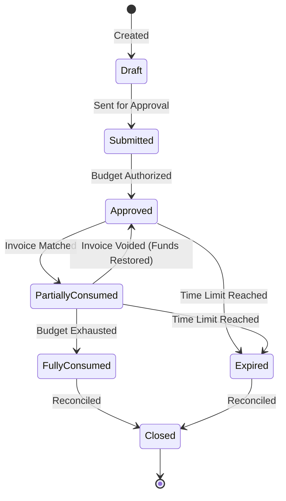

# ADR-005: Purchase Order Governance

## Status
**Proposed / Under Discovery**

## Context & Problem Statement
Our Operational Governance Platform currently manages the compliance of the legal entity (`ADR-002: Supplier Governance`), the individual executing the work (`ADR-003: Contractor Governance`), and the operational rules for moving money (`ADR-004: Financial Control Governance`).

However, a major control gap remains: **Pre-Spend Authorization**.
A supplier can be legally valid, the contractor fully compliant, and the financial state machines perfectly respected—but the invoice could still represent unauthorized spend if the work itself was never budgeted or formally approved prior to execution.

A "valid invoice" is not enough. We require **"Authorized Spend + Valid Invoice."**

This ADR opens discovery on integrating strict Purchase Order (PO) Governance into the platform to establish a true **Three-Way Match** capability (PO ↔ Timesheet/Receipt ↔ Invoice).

## Defined Scope
This ADR defines the rules, lifecycle states, and financial constraints of Purchase Orders within the contractor lifecycle.

---

## Policy Discovery: Open Questions

To establish PO Governance as the primary anchor for financial authorization, stakeholders must answer the following:

### 1. PO Requirement
Should the Purchase Order become the mandatory trigger for financial billing?
*   **Mandatory Default:** Is a supplier invoice strictly required to reference an approved PO?
*   **Exceptions:** What are the authorized bypasses? (e.g., emergency procurement, retroactive POs, manual overrides via dual approval).

### 2. PO Scope & Cardinality
What does a PO specifically authorize?
*   **Entity Linkage:** Is a PO tied to the overarching Supplier, the Master Contract, a specific Engagement, or an individual Contractor?
*   **Cardinality:** Can one PO cover multiple invoices (draw-down)? Can a single consolidated invoice consume funds from multiple POs?

### 3. Budget Control Mechanisms
How strictly does the PO enforce the boundaries of the spend?
*   **Value Caps:** Does it hard-block invoices that exceed the Max Amount?
*   **Unit Caps:** Does it restrict Max Hours or specific Quantities?
*   **Time Bounds:** Does the PO have a hard Expiry Date independent of the Supplier Contract?

### 4. Matching Logic
What level of automated reconciliation is required?
*   **2-Way Match:** Does the system simply verify that Invoice Amount ≤ PO Amount?
*   **3-Way Match:** Must the system verify that Invoice Amount ↔ matches Approved Timesheets ↔ matches PO Budget?

### 5. Compliance & Exceptions
How does the system handle edge cases at the point of invoice submission?
*   What happens if an invoice exceeds the remaining PO value? (Soft warning vs. Hard block)
*   What happens if the PO is technically valid, but belongs to a different supplier subsidiary?
*   If an invoice is submitted without a PO, does it enter a "Hold" state pending a Retroactive PO, or is it instantly rejected?

---

## Proposed Architecture

### 1. Fundamental Principle
**No PO → No Authorized Commitment → No Payable.**
By default, the platform will treat the absence of a PO as a hard block on invoice submission.

### 2. PO Lifecycle State Machine
We propose the following state chain for Purchase Orders:

### 3. The End-to-End Governance Flow
With PO governance, the platform achieves end-to-end operational control:
1.  **Supplier Approved** *(Entity valid)*
2.  **Contract Active** *(Legal terms valid)*
3.  **PO Approved** *(Spend authorized)*
4.  **Work Performed** *(Contractor compliant)*
5.  **Timesheet Approved** *(Service verified)*
6.  **Invoice Submitted** *(Billing generated)*
7.  **3-Way Match** *(PO ↔ Timesheet ↔ Invoice)*
8.  **Payment Released** *(Financial Control passed)*

## Consequences
Implementing PO Governance transforms this system from an administrative CMS into a true **End-to-End Spend Governance Platform**. It eliminates reactive billing and ensures that all money movement represents a controlled settlement against a pre-approved budget.
