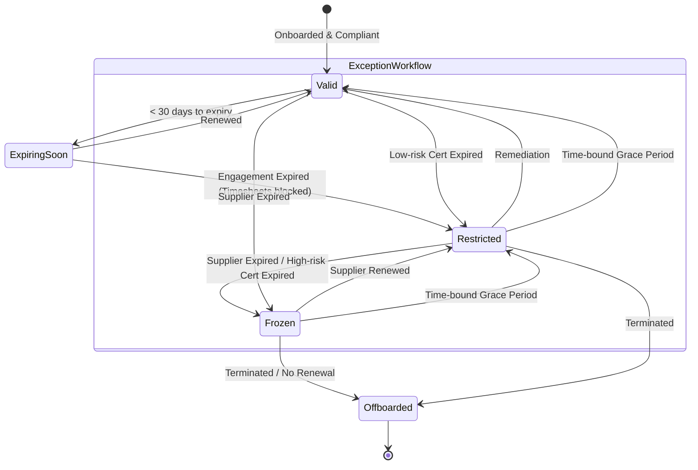

# Contractor Lifecycle Governance Review Pack

## 1. Executive Summary
While Supplier Governance secures our external legal entities, **Contractor Lifecycle Governance** secures the individual human access and execution. Currently, contractor validity relies on disparate data points and manual oversight. Establishing a unified, policy-driven lifecycle ensures that individual workforce members are only permitted to operate, bill, and access systems when fully compliant and actively engaged.

## 2. Operational Risk of Lifecycle Gaps
A fragmented contractor lifecycle exposes the organization to significant operational risk:
*   **Unauthorized Billing:** Contractors submitting timesheets after their engagement expires.
*   **Compliance Violations:** Contractors continuing to operate with lapsed certifications (e.g., background checks, safety credentials).
*   **Access Risks:** "Zombie contractors" retaining system access long after their projects complete.
*   **Operational Brittleness:** Binary "Active/Suspended" states that lack nuance, often causing critical mid-flight projects to crash due to minor administrative delays.

## 3. Current Platform Capability
We are preparing to deploy a **Visibility-First** framework for the workforce:
*   **Dashboards:** Early-warning widgets for expiring engagements and missing compliance documents.
*   **Data Models:** A unified schema linking contractors to suppliers, engagements, and certifications.
*   **Audit Integration:** Canonical event logging for profile and role mutations.

## 4. Policy Decision Matrix
Stakeholders must define the business rules governing this lifecycle.

| Decision Area | Recommended Path |
| ------------- | ---------------- |
| **1. Validity Source** | **Combined model** (Profile + Engagement + Supplier + Compliance) |
| **2. Expiring Threshold** | **30 days** (Fast-moving individual lifecycle) |
| **3. Engagement Expiry** | **Block timesheets** (Forces operational hygiene without destructive auto-offboarding) |
| **4. Supplier Expiry** | **Freeze new activity pending review** (Preserves active work/approvals to prevent immediate operational shutdown) |
| **5. Cert Expiry** | **Tiered Approach** (Low-risk = Block assignment; High-risk = Full block) |
| **6. Missing Docs** | **Compliance violation** (Forces remediation during onboarding) |
| **7. Automation Level** | **Approval workflow & Audit Events** (Human-in-the-loop oversight) |
| **8. Exceptions** | **Time-bound exception with approval** (Prevents governance brittleness) |

## 5. Recommended Defaults & Rationale
Our recommended defaults treat human workforce governance as a **composite risk model**. Rather than a blunt "Active or Suspended" switch, we recommend a nuanced approach that blocks specific risky actions (like timesheet submission or new assignments) while preserving historical data and allowing safe, active reviews to continue.

## 6. Grace Period / Exception Governance
Governance without exception management becomes brittle. Real-world operations require flexibility.
We recommend a **Time-bound Exception Workflow**:
*   Operations can request an override (e.g., a 14-day grace period for a delayed background check).
*   The override requires managerial approval.
*   The system emits an `EXCEPTION_GRANTED` audit event.
*   The system automatically revokes the override when the timer expires.

## 7. Contractor Lifecycle State Machine
To support these policies, the system will model the contractor lifecycle as a strict state machine:

*   **Valid**: Fully compliant, actively engaged.
*   **Expiring Soon**: Within the 30-day renewal window.
*   **Restricted**: Specific operational blocks applied (e.g., timesheets locked), but core access remains.
*   **Frozen**: New activity completely halted pending review (e.g., parent supplier expired).
*   **Offboarded**: Final state. Access revoked.

## 8. Visibility-First Roadmap
1.  **Phase 1 (Visibility):** Dashboards surface the exact state of all contractors without blocking any actions.
2.  **Phase 2 (Policy Definition):** Stakeholders approve this Review Pack.
3.  **Phase 3 (Enforcement):** Engineering builds the State Machine and NATS automation to enforce the blocks.

## 9. Approval Checklist
To authorize engineering to begin building this state machine and enforcement architecture, please sign off:

- [ ] **Business Owner** (Approves lifecycle states and exception workflows)
- [ ] **Compliance / HR** (Approves certification tiers and document requirements)
- [ ] **Operations** (Approves engagement expiry impacts and grace periods)
- [ ] **Security** (Approves audit logging and access revocation triggers)
