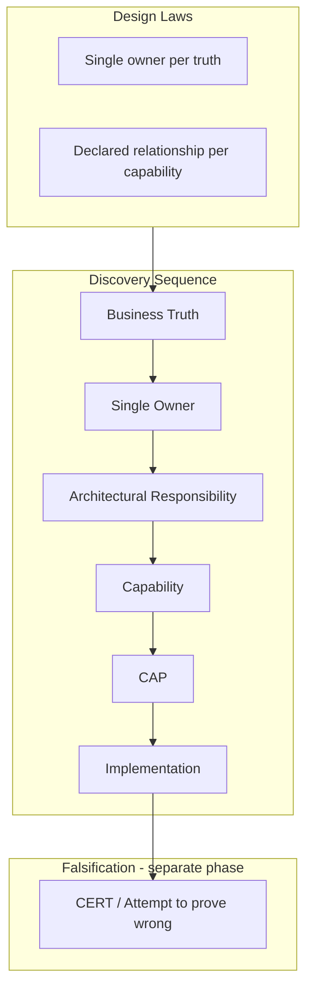
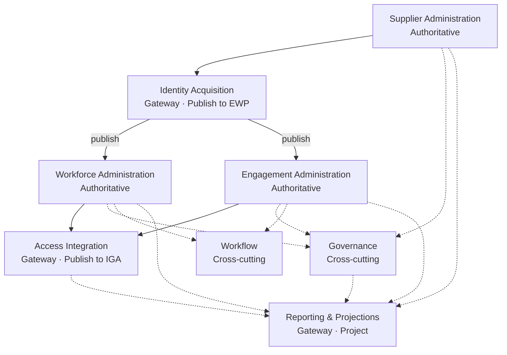

# External Workforce Platform — Architecture

**Product:** External Workforce Platform (EWP)
**Status:** Operational architecture (May 2026)
**Audience:** Engineers, architects, product owners

> **Start here** for how EWP is structured. **Implement from** the Capability Map and CAPs. **Do not extend** this document with new abstractions — update CAPs and CERTs instead.

---

## Entry point

> If a design discussion cannot identify the **business truth** being affected, **stop**. The architecture has not yet begun.

Then ask:

> **What truth is being changed?**

See [`ARCHITECTURAL_RESPONSIBILITIES_V1.md`](./ARCHITECTURAL_RESPONSIBILITIES_V1.md) for the full discovery sequence and design laws.

---

## What EWP is

The **External Workforce Platform** is the enterprise system for administering, governing, and integrating the **external workforce** — independently of employee HCM, while integrating with IGA, supplier systems, and enterprise workflows.

| Layer | Name | Notes |
|-------|------|-------|
| Product | External Workforce Platform (EWP) | [`ADR-012`](./ADR-012-External-Workforce-Platform-Naming.md) |
| Business object | External Worker | Implemented as `Contractor` in v1 |
| Architecture | Capability-driven | Organised around **business truths**, not modules |

**Core business question:**

> How does an enterprise administer and govern its external workforce?

---

## Design laws

Two laws generate the entire architecture:

**Law 1 — Single ownership**

> Every enduring business truth **SHALL** have exactly one authoritative owner.

**Law 2 — Declared relationship**

> Every capability **SHALL** define its relationship to that truth.

| Architectural responsibility | Relationship to truth | Protects |
|------------------------------|----------------------|----------|
| **Authoritative** | **Owns** | Ownership |
| **Gateway** | **Transfers** (publish, project) | Transfer |
| **Cross-cutting** | **Consumes** (coordinate; never replace) | Consumption |

---

## Architecture model

EWP is organised around **business truths** and **architectural responsibilities** — not around services, screens, or org charts.



**Burden of design:** Given the business truth, what structures are **impossible**? Each discovery step **eliminates** invalid choices — it does not brainstorm new ones.

```text
Meaning → Truth → Ownership → Responsibility → Capability → Code
```

---

## Business truths and capabilities

| Business truth | Business area | Responsibility | Capability | CAP | CERT |
|----------------|---------------|----------------|------------|-----|------|
| Supplier trust | Supplier | Authoritative | Supplier Administration | v1.0 | Template |
| Workforce relationship | Workforce | Authoritative | Workforce Administration | v1.0 | **PASS** |
| Commercial placement | Engagement | Authoritative | Engagement Administration | v1.0 | Template |
| Identity publication | Identity | Gateway | Identity Acquisition | v1.0 | **PASS** |
| Access intent | Access | Gateway | Access Integration | v1.0 | **PASS** |
| Operational projections | Reporting | Gateway | Reporting & Projections | v1.0 | **PASS** |
| Process coordination | Workflow | Cross-cutting | Workflow Orchestration | Planned | — |
| Truth alignment signals | Governance | Cross-cutting | Governance | Planned | — |

**Validation status (May 2026):**

| Responsibility | Failure mode | Status |
|----------------|--------------|--------|
| Authoritative | Ownership leakage | **Validated** |
| Gateway | Transfer leakage | **Validated** |
| Cross-cutting (Workflow) | State leakage | **Predicted** |
| Cross-cutting (Governance) | Judgement leakage | **Predicted** |

---

## Platform chronology

Authoritative capabilities **own** truth after gateway handover.



```text
Supplier exists (authoritative)
        │
        ▼
Identity Acquisition — acquire · validate · publish
        │
        ▼ ══════ publication boundary ══════
Workforce Administration — workforce state / history
        │
        ▼
Engagement Administration — placement · commercial context
        │
        ├── Access Integration — intent to IGA (gateway)
        ├── Governance — alignment signals (cross-cutting)
        ├── Workflow — coordinate handover (cross-cutting)
        └── Reporting — operational projections (gateway)
```

---

## Three architectural responsibilities

```text
AUTHORITATIVE — own business truth until a command changes it
├── Supplier Administration
├── Workforce Administration
└── Engagement Administration

GATEWAY — transfer truth; end at handover
├── Identity Acquisition      → Publish to EWP
├── Access Integration        → Publish to IGA
└── Reporting & Projections   → Projection for consumption

CROSS-CUTTING — consume truth; SHALL NOT create or replace it
├── Workflow Orchestration    → Handover (predicted)
└── Governance                → Finding (predicted)
```

**Gateway terminal operations** differ by business area; **falsification strategy** is shared per responsibility.

**No fourth responsibility.** If a feature does not own, transfer, or consume truth around a defined business truth — that is a rare architectural discovery.

---

## Engineering chain

```text
ADR (why)
  ↓
CAP (what must always be true)
  ↓
PR (what changed — cite CAP §)
  ↓
CERT (attempt to falsify responsibility)
```

CERT **falsifies the architectural responsibility**, not checklist prose:

| Responsibility | Primary falsification question |
|----------------|------------------------------|
| Authoritative | Can anyone else own this truth? |
| Gateway | Did it stop at transfer/projection? |
| Cross-cutting | Did it accidentally create truth? |

```text
Discover → Specify → Implement → Attempt to prove yourself wrong
```

---

## Proof sequence (next empirical work)

```text
1. CAP Workflow Orchestration → falsify state leakage
2. CAP Governance             → falsify judgement leakage
```

Reporting module consolidation is **implementation improvement** — Gateway architecture already survived falsification.

---

## Product projections

Capabilities compose into experiences; a product is one way of using capabilities.

| Projection | Capabilities |
|------------|--------------|
| **Supplier Portal** | Supplier, Workforce (nominate), Engagement |
| **Operations Console** | Workforce, Engagement, Governance, Reporting |
| **Identity Services** | Identity Acquisition, Access Integration |

Console navigation mirrors operational capabilities — see [`PR-NAV-CAPABILITY-IA-2_NAV_FREEZE.md`](./PR-NAV-CAPABILITY-IA-2_NAV_FREEZE.md).

---

## Where detail lives

| Question | Document |
|----------|----------|
| How is the platform structured (business)? | [`EWP_ARCHITECTURE.md`](./EWP_ARCHITECTURE.md) |
| How is it built (technical)? | [`EWP_TECHNICAL_ARCHITECTURE.md`](./EWP_TECHNICAL_ARCHITECTURE.md) |
| Where does this feature belong? | [`EXTERNAL_WORKFORCE_CAPABILITY_MAP.md`](./EXTERNAL_WORKFORCE_CAPABILITY_MAP.md) |
| What are the frozen primitives? | [`ARCHITECTURAL_RESPONSIBILITIES_V1.md`](./ARCHITECTURAL_RESPONSIBILITIES_V1.md) |
| What must this capability do? | `capabilities/CAP-*.md` |
| Did implementation survive falsification? | `capabilities/CERT-*.md` |
| What changed in code? | `PR-*.md` (cite CAP §) |
| What do we call things? | [`EXTERNAL_WORKFORCE_VOCABULARY.md`](./EXTERNAL_WORKFORCE_VOCABULARY.md) |
| Engineering method | [`EXTERNAL_WORKFORCE_CAPABILITY_ENGINEERING_MODEL.md`](./EXTERNAL_WORKFORCE_CAPABILITY_ENGINEERING_MODEL.md) |
| v1 freeze rules | [`EWP-V1-ARCHITECTURE-FREEZE.md`](./EWP-V1-ARCHITECTURE-FREEZE.md) |
| CAP directory | [`capabilities/README.md`](./capabilities/README.md) |

---

## Programme status

**Architecture programme closed** (May 2026). The architecture governs engineering — it no longer discovers itself.

| Era | Status |
|-----|--------|
| Discovery · Decomposition | **Complete** |
| Empirical validation (Authoritative, Gateway) | **Validated** |
| Empirical validation (Cross-cutting) | **In progress** — Workflow, Governance |

Further architecture work is **CERT and implementation**, not new models. See [`ARCHITECTURAL_RESPONSIBILITIES_V1.md`](./ARCHITECTURAL_RESPONSIBILITIES_V1.md) § Architecture programme — closed.

---

## Document control

| Version | Change |
|---------|--------|
| **1.0** | Canonical EWP architecture overview — May 2026 |

Changes **SHALL** be limited to validation status, new capability rows, and links — not new architectural primitives.
