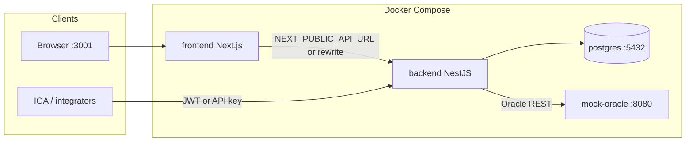
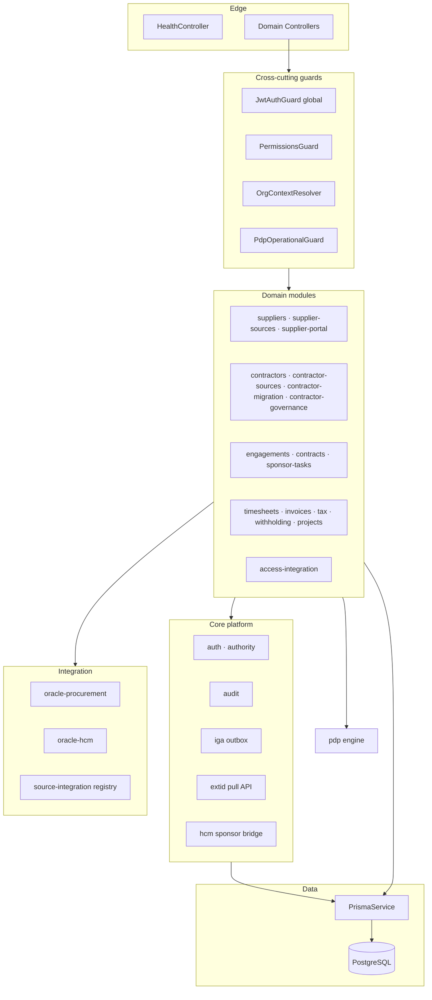

# External Workforce Platform — Technical Architecture

**Product:** External Workforce Platform (EWP)
**Status:** v1 reference implementation (May 2026)
**Companion:** [`EWP_ARCHITECTURE.md`](./EWP_ARCHITECTURE.md) (business architecture)

> **Business truth first.** Map every technical change to a capability and CAP before adding modules. See [`ARCHITECTURAL_RESPONSIBILITIES_V1.md`](./ARCHITECTURAL_RESPONSIBILITIES_V1.md).

---

## Stack summary

| Layer | Technology | Location |
|-------|------------|----------|
| API | NestJS 11, Express, TypeScript | `backend/src/` |
| ORM / DB | Prisma 6, PostgreSQL 16 | `backend/prisma/` |
| UI | Next.js 15, React 19, Tailwind | `frontend/` |
| Auth | JWT + Passport, argon2, API keys | `backend/src/core/auth/` |
| Policy | PDP (shadow → enforce) | `backend/src/pdp/` |
| Local runtime | Docker Compose | `docker-compose.yml` |
| Upstream stubs | Mock Oracle REST | `mock-oracle/` |

**API surface:** `http://localhost:3000/api/v1` · Swagger `/api/docs` · Health `/api/v1/health/liveness`

---

## Runtime topology



| Service | Host port | Role |
|---------|-----------|------|
| `frontend` | 3001 | Next.js dev server; proxies `/api/*` to backend in dev |
| `backend` | 3000 | NestJS API; entrypoint runs migrate + seed |
| `postgres` | 5433→5432 | Primary datastore (`contractor_cms`) |
| `mock-oracle` | 8080 | Procurement + HCM fixture REST for connectors |

**Startup** (`backend/docker-entrypoint.sh`): `prisma migrate deploy` → fallback `db push` → `prisma generate` → `db seed` → optional connector demo reset (`DEMO_MODE`) → `npm run start:dev`.

---

## Repository layout

```text
contractor-cms/
├── backend/
│   ├── src/core/           # Platform infrastructure (auth, audit, iga, extid, config)
│   ├── src/domain/         # Business capabilities (bounded contexts)
│   ├── src/integration/    # Oracle REST clients + source adapter registry
│   ├── src/pdp/            # Policy Decision Platform
│   └── prisma/             # Schema, migrations, seed
├── frontend/
│   ├── app/                # App Router pages
│   ├── components/         # UI by feature
│   └── lib/                # API client, auth, generated permissions
├── mock-oracle/            # Local upstream stub
└── docs/business/          # Architecture + CAPs
```

---

## Backend layering



### Layer rules

| Layer | Path | Responsibility |
|-------|------|----------------|
| **Core** | `backend/src/core/` | Auth, tenancy resolution, audit, IGA outbox transport, EXTID feed, shared config |
| **Domain** | `backend/src/domain/` | Authoritative + gateway business logic per capability |
| **Integration** | `backend/src/integration/` | Upstream REST adapters; no enduring business truth |
| **PDP** | `backend/src/pdp/` | Cross-cutting policy evaluation (consumes truth; does not own it) |

**Global defaults** (`app.module.ts`): `JwtAuthGuard` on all routes unless `@Public()`; `HttpExceptionFilter`; env validated via `env.validation.ts`.

---

## Business capability → code mapping

| Capability | Primary modules | Key persistence |
|------------|-----------------|-----------------|
| **Supplier Administration** | `domain/suppliers/`, `supplier-portal/` | `Supplier`, `SupplierDocument`, `SupplierMembership` |
| **Workforce Administration** | `domain/contractors/` | `Contractor`, `ContractorWorkforceHistory` |
| **Engagement Administration** | `domain/engagements/`, `contracts/`, `timesheets/`, `invoices/`, `projects/`, `sponsor-tasks/` | `ContractorEngagement`, `SupplierContract`, `Timesheet`, `Invoice` |
| **Identity Acquisition** | `domain/contractor-migration/`, `contractor-sources/` (ingest) | `HcmContractorStaging`, `ContractorMigrationBatch` |
| **Access Integration** | `domain/access-integration/` → `core/iga/` | `IgaOutboxEvent` |
| **Reporting & Projections** | `domain/analytics/`, `core/audit/audit-insights.*`, supplier governance dashboard | Read-only queries |
| **Governance** | `domain/contractor-governance/`, `supplier-sources/` (drift), `pdp/` | `ContractorSourceDrift`, `PdpActivationRule`, `AuditLog` |
| **Administration** | `domain/users/`, `roles/`, `organizations/` | `User`, `Role`, `Organization` |

Connector operations UIs map to **Identity Acquisition** (`/contractor-sources/oracle-hcm/operations`) and **Supplier** sync (`/supplier-sources/oracle/operations`).

---

## Request path (authenticated API)

```text
HTTP request
    → JwtAuthGuard (or @Public + JwtOrApiKeyGuard for integration routes)
    → PermissionsGuard (@Permissions)
    → OrgContextResolver (@RequiresOrgContext / @OrgContext)
    → Controller
    → Service (domain logic)
    → Prisma transaction
    → AuditService (immutable log)
    → Optional: PdpOperationalGuard.assertAllowed
    → Optional: AccessIntegrationPublishService (IGA outbox)
```

**Access context** (`AccessContext`): actor user, target organization, global-access flag, supplier portal scope, sponsor employee reference — built in `org-context-resolver.service.ts`. Frontend **must not** send `organizationId` for scoping (`frontend/lib/api-contract.ts`).

---

## Data architecture

**Single database**, schema-first via Prisma (`backend/prisma/schema.prisma`).

### Tenancy

- `Organization` is the tenant root.
- Domain rows carry `organizationId` (or resolve via `Supplier` / `Contractor` nesting).
- `OrgContextResolverService` enforces scope on nested resources.

### Authority modes (tenant config)

Stored on `Organization`:

- `supplierAuthorityMode` — CMS vs Oracle procurement authority
- `contractorAuthorityMode` — CMS vs HCM authority

Enforced in `backend/src/core/authority/` and supplier/contractor lifecycle services.

### Major aggregates

```text
Organization
├── Supplier (+ staging, sync runs, drifts, documents)
├── Contractor (+ workforce history, EXTID substrate, acquisition model)
│   ├── ContractorEngagement (+ sponsor accountability fields)
│   ├── Timesheet → Invoice (commercial plane)
│   └── TaxClassification / WithholdingInstruction
├── HcmContractorStaging (+ migration batch, quarantine, pipeline status)
├── IgaOutboxEvent (access intent transport)
├── AuditLog / PdpActivationRule / PdpExceptionRequest
└── SponsorAccountabilityTask
```

**v1 naming:** business **External Worker** = Prisma `Contractor` = API `/contractors`.

---

## Security architecture

### Authentication

| Mechanism | Use |
|-----------|-----|
| JWT (Bearer) | Interactive users; global default guard |
| Local + Passport | Login |
| API key (`X-API-Key`) | Integrations (EXTID pull, automation) |
| argon2 | Password and API key hashing |

### Authorization (RBAC)

```text
permissions.catalog.json
    → permissions.constants.ts (backend)
    → permissions.generated.ts (frontend, npm run rbac:generate)
```

- `@Permissions('resource:action')` on controllers.
- System role bundles: `seed-system-role-bundles.ts`.
- Scope helpers: supplier, sponsor, finance visibility.

### Policy Decision Platform (PDP)

```text
Domain action (e.g. SUBMIT_TIMESHEET)
    → PdpEngine.evaluate (supplier, contractor, financial, workforce rules)
    → Activation level (SHADOW … HARD_BLOCK)
    → ALLOW | BLOCK | APPROVAL_REQUIRED
    → AuditLog + optional PdpExceptionRequest
```

PDP **consumes** authoritative state; it does not own supplier/workforce/engagement truth.

---

## Integration architecture

### Source integration registry

`backend/src/integration/source-integration.module.ts` registers adapters:

| Adapter | Upstream | Domain consumer |
|---------|----------|-----------------|
| Oracle Procurement REST | `mock-oracle` / customer Oracle | `supplier-sources/` |
| Oracle HCM REST | `mock-oracle` / customer HCM | `contractor-sources/`, `contractor-migration/` |

**Pattern:** extract → stage (immutable `sourcePayloadJson`) → correlate → validate → promote (authoritative write) or quarantine.

### Identity Acquisition pipeline (HCM)

```text
Oracle HCM REST / file ingest
    → HcmContractorStaging
    → normalize · validate · correlate
    → promote-hcm-contractor-to-cms.service
    → Contractor (authoritative) + AccessIntegration publish
```

Modules: `contractor-migration/`, `contractor-sources/`, `integration/oracle-hcm/`.

### Access Integration (IGA gateway)

```text
Workforce / Engagement / Promote events
    → AccessIntegrationPublishService
    → IgaOutboxService → IgaOutboxEvent
    → (optional) IgaDispatchSchedulerService when IGA_DISPATCH_ENABLED
    → stub / future enterprise IGA adapter
```

CMS **does not** execute provisioning. EXTID pull API (`core/extid/`) lets IGA consume events separately from outbox persistence.

### Reporting (read-only projections)

| Projection | Implementation |
|------------|----------------|
| Audit insights | `AuditInsightsService` |
| Supplier governance buckets | `SupplierGovernanceDashboardService` |
| Analytics summaries | `AnalyticsService` |
| Workforce timeline | `ContractorsService.listWorkforceTimeline` |

No unified `reporting-projections` module yet — CERT PASS on distributed read paths.

---

## Frontend architecture

**App Router** (`frontend/app/`). Root layout: `AuthProvider`, toasts, error boundary.

### API access

- `lib/api.ts` — Axios singleton, Bearer token, 401 → login.
- `next.config.js` — dev rewrite `/api/*` → `BACKEND_URL`.
- Feature clients: `api-audit.ts`, `api-supplier-portal.ts`, `services/*.ts`.

### Navigation & gating

- `lib/protected-routes.ts` — route → permission map.
- `components/dashboard-layout.tsx` — shell + nav.
- `app/dashboard/page.tsx` — role-aware dashboard; `CapabilityOverview` for capability health.

### Route ↔ capability (examples)

| Route | Capability |
|-------|------------|
| `/suppliers`, `/suppliers/approvals` | Supplier Administration |
| `/contractors`, `/contractors/workforce-review` | Workforce Administration |
| `/engagements`, `/timesheets`, `/invoices` | Engagement Administration |
| `/contractor-sources/oracle-hcm/operations` | Identity Acquisition |
| `/settings/audit-insights`, `/settings/pdp-*` | Governance / Reporting |

---

## Cross-cutting platform services

| Concern | Module | Notes |
|---------|--------|-------|
| Audit | `core/audit/` | Immutable `AuditLog`; CSV export; insights aggregation |
| Health | `core/health/` | Liveness, readiness (DB ping), demo-config |
| HCM sponsor bridge | `core/hcm/` | Sponsor lookup; env-gated |
| EXTID | `core/extid/` | Pull feed for external identity consumers |
| Demo / connector reset | `scripts/seed-connector-demo.ts` | `DEMO_MODE` compose default |

**Events (v1):** durable `IgaOutboxEvent`; workforce domain reactions via `access-integration-workforce-reaction.service.ts`. NATS dependency present; broker publishing is a future integration milestone.

---

## Configuration

| Source | Purpose |
|--------|---------|
| `backend/.env` / compose `environment` | Runtime secrets and connector URLs |
| `backend/.env.example` | Documented variables |
| `env.validation.ts` | Boot-time schema validation |
| `oracle-procurement.config.ts` / `oracle-hcm.config.ts` | Connector feature flags + endpoints |

Key flags: `DEMO_MODE`, `ORACLE_*_REST_ENABLED`, `HCM_*_REST_ENABLED`, `IGA_DISPATCH_ENABLED`, `SPONSOR_ACCOUNTABILITY_INBOX_ENABLED`.

---

## Testing architecture

| Suite | Config | Location |
|-------|--------|----------|
| Backend unit | `jest.unit.config.js` | `backend/src/**/*.spec.ts` |
| Backend e2e | `jest.config.js` | `backend/test/*.e2e-spec.ts` |
| Frontend unit | `frontend/jest.config.js` | `frontend/__tests__/` |

E2E coverage includes: auth/RBAC matrix, supplier Oracle connector, HCM connector + migration, supplier portal, sponsor scope, EXTID feed, workforce UAT, financial flows.

**RBAC CI:** `npm run rbac:verify` — regenerate permissions and fail on drift.

---

## Engineering discipline (technical)

```text
ADR → CAP → PR (cite CAP §) → CERT (falsify responsibility)
```

Implementation **SHALL** cite CAP sections in PRs. New domain modules **SHALL** map to an existing business capability before merge.

---

## Related documents

| Doc | Role |
|-----|------|
| [`EWP_ARCHITECTURE.md`](./EWP_ARCHITECTURE.md) | Business architecture overview |
| [`EXTERNAL_WORKFORCE_CAPABILITY_MAP.md`](./EXTERNAL_WORKFORCE_CAPABILITY_MAP.md) | Capability tree + proof sequence |
| [`ARCHITECTURAL_RESPONSIBILITIES_V1.md`](./ARCHITECTURAL_RESPONSIBILITIES_V1.md) | Discovery sequence + design laws |
| [`EXTERNAL_WORKFORCE_CAPABILITY_ENGINEERING_MODEL.md`](./EXTERNAL_WORKFORCE_CAPABILITY_ENGINEERING_MODEL.md) | ADR → CAP → PR → CERT |
| [`../DEMO_LOGIN_CREDENTIALS.md`](../DEMO_LOGIN_CREDENTIALS.md) | Local demo users |
| [`../../README.md`](../../README.md) | Runbook, scripts, extended ADR index |

---

## Document control

| Version | Change |
|---------|--------|
| **1.0** | Initial technical architecture — May 2026 |

Update when runtime topology, major modules, or integration boundaries change — not for every feature PR.
