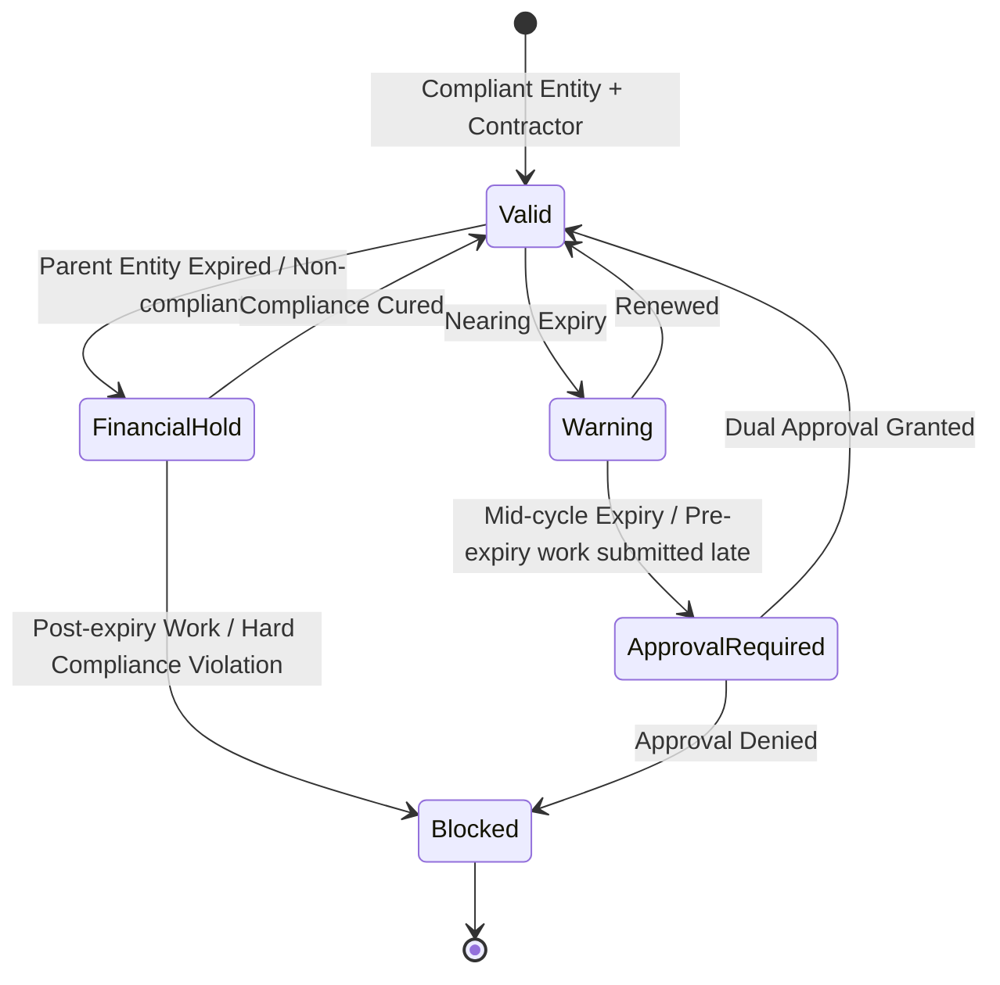

# Financial Control Governance Review Pack

## 1. Executive Summary
Financial Control Governance is the enforcement layer of our operational ecosystem. While Supplier Governance dictates *which entities can exist* and Contractor Governance dictates *who can access systems*, Financial Governance determines **what money is allowed to move**. 

Without strict financial controls, compliance gaps result in direct financial leakage. This document unifies entity compliance with spend authorization, transforming our system into an ERP-adjacent governance engine.

## 2. Compliance Leakage Risk
Organizations typically leak compliance at the intersections of lifecycles. Real-world risks include:
*   **Unauthorized Labor:** A contractor's legal engagement expires, but they continue working and billing.
*   **Invalid Supplier Payments:** A master supplier agreement expires, but invoices are still generated and paid.
*   **Mid-Cycle Lapses:** A contractor passes background checks at the start of the month but fails a re-certification mid-month, yet their invoice is still approved.
*   **Zombie Accruals:** Unlimited retroactive timesheets destroying the accuracy of financial forecasting.

## 3. Current Platform Capability
We currently possess a mature **Visibility Layer**:
*   Supplier expiration tracking and dashboard widgets.
*   Contractor validity data modeling.
*   Audit integration.

We must now weaponize this visibility into financial gates.

## 4. Financial Decision Matrix
Stakeholders must define the business rules governing financial boundaries.

| Decision Area | Recommended Path |
| ------------- | ---------------- |
| **1. Expired Contractor Timesheets** | **Tiered:** Approval Req. for pre-expiry work; Hard Block for post-expiry work. |
| **2. Expired Supplier Invoices** | **Block** generation. Forces the supplier to cure the master contract. |
| **3. Expired Engagement Billing** | **Grace Period** for final reconciliation only; no new billable activity allowed. |
| **4. Mid-Cycle Expiry** | **Approval Required** to ensure Finance acknowledges the breach before releasing funds. |
| **5. Retroactive Timesheets** | **30-day cap** to protect financial forecasting. |
| **6. Override Authority** | **Dual approval** (Ops + Finance) to balance necessity with risk. |
| **7. Audit Requirements** | **Approval workflow & Audit Events** to create an unassailable paper trail. |
| **8. Billing Grace Period** | **7 days** to allow administrative wrap-up without exposing major spend. |

## 5. Financial Lifecycle State Machine
To implement these policies, billing artifacts (timesheets, invoices) will follow this explicit state machine:

*   **Valid:** Flow continues normally.
*   **Warning:** Flagged for operations.
*   **Approval Required:** Hard stop requiring explicit managerial/financial override.
*   **Financial Hold:** Temporarily paused pending overarching compliance cure (e.g. Master contract signed).
*   **Blocked:** Systemic rejection of operation.

## 6. Pre/Post Expiry & Reconciliation Governance
To prevent unauthorized labor while supporting legitimate late submissions, we enforce a strict distinction:
*   **Pre-Expiry Work Submitted Late:** Placed in `Approval Required` state. A manager must verify the work occurred *before* the compliance lapse.
*   **Post-Expiry Work:** Placed in `Blocked` state. The system absolutely prohibits logging hours for dates occurring after expiration.
*   **Final Reconciliation Grace:** The 7-day grace period for expired engagements applies **only** to consolidating and reconciling already-completed work into a final invoice. It does not permit logging net-new activity.

## 7. Dual Approval Governance
Operational necessity cannot override financial compliance in a silo. 
When an exception is requested (e.g., bypassing a block):
1.  **Operations** must approve to verify *why* the work happened.
2.  **Finance** must approve to accept the *financial/compliance risk* of paying it.

## 8. Visibility-First Roadmap
1.  **Phase 1 (Visibility):** Dashboards highlight "Spend at Risk" without stopping submission.
2.  **Phase 2 (Policy Definition):** Stakeholders approve this Review Pack.
3.  **Phase 3 (Enforcement):** Engineering builds the Financial Hold State Machine, tying it to Supplier and Contractor lifecycles via NATS.

## 9. Approval Checklist
To authorize engineering to begin building this financial state machine, please sign off:

- [ ] **Finance / CFO** (Approves retroactive caps and dual approval workflow)
- [ ] **Compliance / Legal** (Approves pre/post expiry rules and invoice blocks)
- [ ] **Operations** (Approves final reconciliation grace periods)
- [ ] **Security** (Approves audit logging of overrides)
