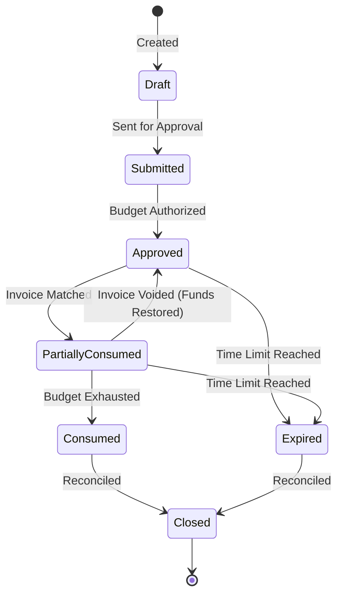

# Purchase Order Governance Review Pack

## 1. Executive Summary
While Supplier and Contractor governance secure *who* can work, and Financial Control secures *how* they are paid, a critical gap remains: **Procurement Authorization**. Without Purchase Order (PO) Governance, an invoice is merely a reactive bill. By establishing a strict PO architecture, we transform invoices into a controlled settlement against a pre-authorized budget, elevating the platform into an **End-to-End Operational Governance Platform**.

## 2. Unauthorized Spend Risk
Without mandatory POs, the organization is exposed to severe financial risk:
*   **Shadow Spend:** Suppliers performing work and invoicing outside of approved department budgets.
*   **Rate Arbitrage:** Invoices billed at unapproved hourly rates because there is no systemic pre-authorization to match against.
*   **Budget Overruns:** Projects exhausting their funding, but suppliers continuing to bill because no systemic cap blocked the invoice submission.

## 3. Current Platform Capability
We have successfully deployed the Visibility Layer for entities and established Financial Control state machines. We must now integrate a **Procurement State Machine** to serve as the definitive source of truth for authorized commercial commitments.

## 4. PO Decision Matrix
Stakeholders must approve the business rules governing procurement authorization:

| Decision Area | Recommended Path |
| ------------- | ---------------- |
| **1. PO Requirement** | **Hard Block (No PO → No Invoice)** |
| **2. PO Budget Scope** | **Combined model** (Enforcing both total value and max hours) |
| **3. PO Expiry** | **Block new drawdown** (Allowing grace period for final reconciliation only) |
| **4. PO Overrun** | **Approval Required** (Forcing managerial override) |
| **5. Supplier Match** | **Hard Block** (Preventing subsidiary mismatches) |
| **6. Timesheet Match** | **Mandatory 3-way match** |
| **7. Amendments** | **Version-controlled + audit** |
| **8. Emergency** | **Dual approval + Mandatory Emergency PO shell** |

## 5. Procurement Lifecycle State Machine
To implement these controls, all Purchase Orders will strictly adhere to the following lifecycle:

## 6. "No PO → No Invoice" Governance
This is the foundational control. By default, the system will execute a **Hard Block** on any invoice submission that does not reference a valid, `Approved` or `Partially Consumed` PO.

## 7. 3-Way Match Governance
To guarantee that we only pay for verified labor against an authorized budget, the system will enforce a **Mandatory 3-Way Match**:
1.  **PO** (Authorizes the budget & rate)
2.  **Timesheet** (Verifies the labor occurred)
3.  **Invoice** (Requests the exact settlement amount)

## 8. Amendment / Change Order Governance
Changes to a PO's budget, scope, or duration cannot be made silently. All amendments must be **Version-controlled**, generating a canonical audit event to preserve the integrity of the original procurement authorization.

## 9. Emergency Procurement Governance
We cannot freeze the business in a true crisis. The system will support an emergency procurement path requiring **Dual Approval** (Operations + Procurement). However, this path mandates the immediate creation of a **Time-Bound Emergency PO Shell** within X days, ensuring that approved spend always resolves to a formal procurement artifact.

## 10. Expiry & Reconciliation Distinctions
To prevent blocking legitimate payment for work completed while the PO was active, we explicitly distinguish between new spend and closeout:
*   **New Spend:** Strictly blocked after the PO Expiry date.
*   **Final Reconciliation Grace:** The system grants a grace period post-expiry *only* to reconcile, submit, and pay invoices for work definitively performed *prior* to the expiry date.

## 11. Visibility-First Roadmap
1.  **Phase 1 (Visibility):** Deploy the PO data model and surface un-PO'd spend on dashboards.
2.  **Phase 2 (Policy):** Stakeholders approve this Review Pack.
3.  **Phase 3 (Enforcement):** Engineering wires the Procurement Lifecycle State Machine into the Financial Control engine.

## 12. Approval Checklist
To authorize engineering to build this procurement authorization layer, please sign off:

- [ ] **Procurement / Sourcing** (Approves the PO lifecycle and emergency shell requirements)
- [ ] **Finance / CFO** (Approves 3-way match and overrun rules)
- [ ] **Operations** (Approves amendment processes and final reconciliation grace periods)
- [ ] **Compliance / Legal** (Approves version-control and audit requirements)
